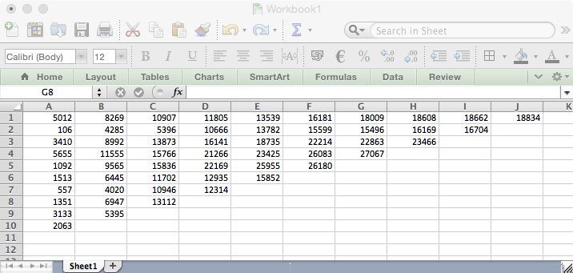
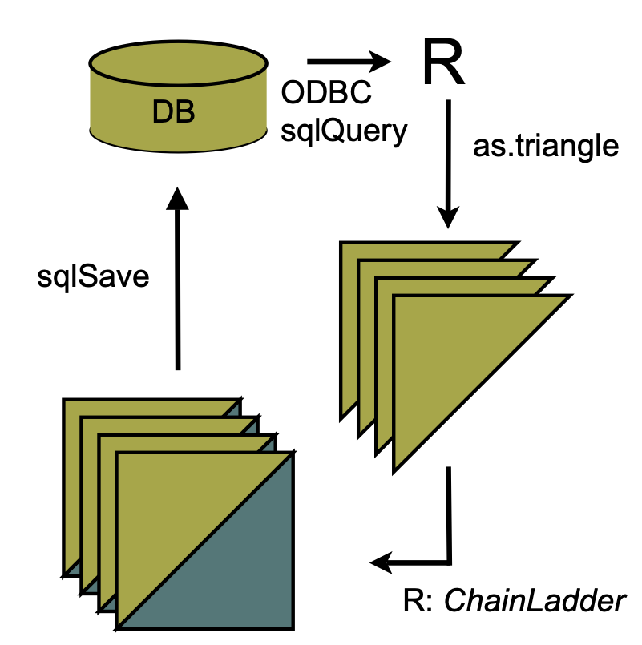
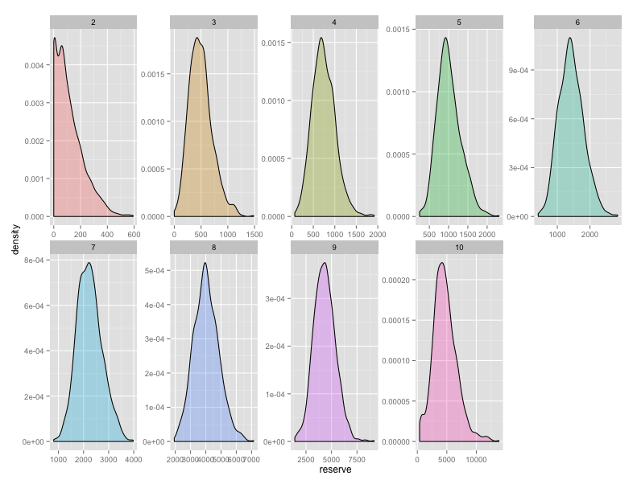
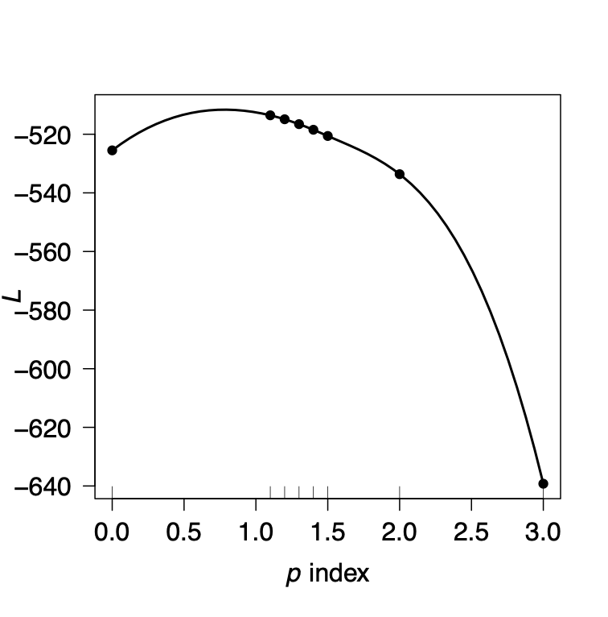

```{r options, echo=FALSE}
library(knitr)
library(lattice)
options(prompt = "R> ", digits = 4, show.signif.stars = TRUE)
options(continue="   ")
opts_chunk$set(
  comment = NA,
  message = FALSE,
  warning = FALSE,
  fig.asp = 0.8,
  fig.width = 6,
  out.width = "60%",
  fig.align = "center"
)
suppressPackageStartupMessages(library(ChainLadder))
```

```{r, echo=FALSE}
print(citation("ChainLadder"), bibtex=FALSE)
```


## Introduction

### Claims reserving in insurance

The insurance industry, unlike other industries, does not sell products
as such but promises. An insurance policy is a promise by the insurer
to the policyholder to pay for future claims for an upfront received
premium.

As a result insurers don't know the upfront cost for their
service, but rely on historical data analysis and judgement to predict a
sustainable price for their offering. In General Insurance (or Non-Life
Insurance, e.g. motor, property and casualty insurance) most policies
run for a period of 12 months. However, the claims payment process
can take years or even decades. Therefore often not even the delivery
date of their product is known to insurers.

In particular losses arising from casualty insurance can take a long
time to settle and even when the claims are acknowledged it may take
time to establish the extent of the claims settlement cost.
Claims can take years to materialize. A complex and
costly example are the claims from asbestos liabilities,
particularly those in connection with mesothelioma and lung damage
arising from prolonged exposure to asbestos.
A research report by a  working party of the Institute and Faculty of Actuaries
estimated that the un-discounted cost of UK mesothelioma-related
claims to the UK Insurance Market for the period 2009 to 2050 could be
around £10bn, see [@Gravelsons2009]. The cost for asbestos
related claims in the US for the worldwide insurance industry was
estimate to be around $120bn in 2002, see [@Michaels2002].

Thus, it should come as no surprise that the biggest item on the
liability side of an insurer's balance sheet is often the provision or
reserves for future claims payments. Those reserves can be broken
down in case reserves (or outstanding claims), which are losses
already reported to the insurance company and losses that are incurred
but not reported (IBNR) yet.

Historically, reserving was based on deterministic
calculations with pen and paper, combined with expert
judgement. Since the 1980's, with the arrival of personal computer,
spreadsheet software became very popular for reserving.
Spreadsheets not only reduced the calculation time, but allowed actuaries
to test different scenarios and the sensitivity of their
forecasts.

As the computer became more powerful, ideas of more sophisticated models
started to evolve. Changes in regulatory requirements, e.g.
Solvency II in Europe, have fostered further research and promoted the 
use of stochastic and statistical techniques. In particular, for many countries 
extreme percentiles of reserve deterioration over a fixed time period have to be
estimated for the purpose of capital setting.

Over the years several methods and models have been developed to
estimate both the level and variability of reserves for insurance claims,
see [@Schmidt2011] or [@EnglandVerrall2002] for an overview.

In practice the Mack chain-ladder and bootstrap chain-ladder models are used
by many actuaries along with stress testing / scenario analysis and expert
judgement to estimate ranges of reasonable outcomes, see the surveys of UK
actuaries in 2002, [@ClaimsReservingWorkingParty:2002], and
across the Lloyd's market in 2012, [@JamesOrr:2012].

## The ChainLadder package

### Motivation

The ChainLadder package provides various
statistical methods which are typically used for the estimation of
outstanding claims reserves in general insurance.  The package started
out of presentations given by Markus Gesmann at the Stochastic
Reserving Seminar at the Institute of Actuaries in 2007 and 2008,
followed by talks at Casualty Actuarial Society (CAS) meetings joined
by Dan Murphy in 2008 and Wayne Zhang in 2010.

Implementing reserving methods in R has several advantages. R provides:

 - a rich language for statistical modelling and data manipulations 
 allowing fast prototyping
 - a very active user base, which publishes many extensions
 - many interfaces to data bases and other applications, such as MS
   Excel
 - an established framework for End User Computing, including
 documentation, testing and workflows with version control systems
 - code written in plain text files, allowing effective knowledge
 transfer
 - an effective way to collaborate over the internet
 - built in functions to create reproducible research reports
 - in combination with other tools such as  LaTeX or RMarkdown
   easy to set up automated reporting facilities
 - access to academic research, which is often first implemented in R

### Brief package overview

This vignette will give the reader a brief overview of the functionality of
the ChainLadder package. The functions are discussed and explained in
more detail in the respective help files and examples, see also
[@gesmann2014claims].

A set of demos is shipped with the packages and the list of demos
is available via:

```{r eval=FALSE}
demo(package="ChainLadder")
```

### Installation

You can install ChainLadder in the usual way from CRAN, e.g.:
```{r eval=FALSE}
install.packages('ChainLadder')
```

For more details about installing packages see [@Radmin]. 

## Using the  ChainLadder package

### Working with triangles

Historical insurance data is often presented in form of a triangle
structure, showing the development of claims over time for each
exposure (origin) period. An origin period could be the year the
policy was written or earned, or the loss occurrence period. Of course the
origin period doesn't have to be yearly, e.g.
quarterly or monthly origin periods are also often used.
The development period of an origin period is also called age or lag.

Data on the diagonals present payments in the same calendar period.
Note, data of individual policies is usually aggregated to homogeneous
lines of business, division levels or perils.

Most reserving methods of the ChainLadder package expect triangles as
input data sets with development periods along the columns and the
origin period in rows. The package comes with several example
triangles.  The following R command will list them all:

```{r eval=FALSE}
library(ChainLadder)
data(package="ChainLadder")
```

Let's look at one example triangle more closely. The following triangle shows
data from the Reinsurance Association of America (RAA):

```{r RAAdata}
RAA
```

This triangle shows the known values of loss from each origin year and of
annual evaluations thereafter. For
example, the known values of loss originating from the 1988 exposure
period are 1351, 6947, and 13112 as of year ends 1988, 1989, and 1990,
respectively. The *latest diagonal* -- i.e., the vector 18834,
16704, $\dots$ 2063 from the upper right to the lower left -- shows
the most recent evaluation available. The column headings -- 1,
2,$\dots$, 10 -- hold the *ages* (in years) of the observations
in the column relative to the beginning of the exposure period. For
example, for the 1988 origin year, the age of the 13112 value,
evaluated as of 1990-12-31, is three years.

The objective of a reserving exercise is to forecast the future claims
development in the bottom right corner of the triangle and potential
further developments beyond development age 10. Eventually all claims
for a given origin period will be settled, but it is not always
obvious to judge how many years or even decades it will take. We speak
of long and short tail business depending on the time it takes to pay
all claims.

#### Plotting triangles

The first thing you often want to do is to plot the data to get an
overview. For a data set of class `triangle` the ChainLadder package
provides default plotting methods to give a graphical overview of the
data:

```{r RAAplot, fig.cap = "Claims development chart of the RAA triangle, with one line per origin period."}
plot(RAA/1000,  main = "Claims development by origin year")
```

Setting the argument `lattice=TRUE` will produce individual
plots for each origin period.

```{r RAAplot2, fig.cap = "Claims development chart of the RAA triangle, with individual panels for each origin period"}
plot(RAA/1000, lattice=TRUE, main = "Claims development by origin year")
```

You will notice from the plots that the triangle `RAA` presents claims
developments for the origin years 1981 to 1990 in a cumulative form.
For more information on the triangle plotting functions see the help
pages of `plot.triangle`.

### Transforming triangles between cumulative and incremental representation

The ChainLadder packages comes with two helper functions,
`cum2incr` and `incr2cum` to transform
cumulative triangles into incremental triangles and vice versa:

```{r }
raa.inc <- cum2incr(RAA)
## Show first origin period and its incremental development
raa.inc[1,]
raa.cum <- incr2cum(raa.inc)
## Show first origin period and its cumulative development
raa.cum[1,]
```

#### Importing triangles from external data sources

In most cases you want to analyse your own data, usually stored in
data bases or spreadsheets.

##### Importing a triangle from a spreadsheet

There are many ways to import the data from a spreadsheet.
A quick and dirty solution is using a CSV-file.

Open a new workbook and copy your triangle into cell A1, with the first column
being the accident or origin period and the first row describing the development 
period or age.

Ensure the triangle has no formatting, such a commas to separate thousands, as
those cells will be saved as characters.


```{r ExcelTriangle, echo=FALSE, fig.cap="Screen shot of a triangle in a spreadsheet software."}

```

Now open R and go through the following commands:

```{r eval=FALSE}
myCSVfile <- "path/to/folder/with/triangle.csv"
## Use the R command:
# myCSVfile <- file.choose() to select the file interactively
tri <- read.csv(file=myCSVfile, header = FALSE)
## Use read.csv2 if semicolons are used as a separator likely
## to be the case if you are in continental Europe
library(ChainLadder)
## Convert to triangle
tri <- as.triangle(as.matrix(tri))
# Job done.
```

\paragraph{Copying and pasting from a spreadsheet}

Small data sets can be transferred to R backwards and forwards
via the clipboard under MS Windows.

Select a data set in the spreadsheet and copy it into the clipboard, then go to
R and type:
```{r eval=FALSE}
tri <- read.table(file="clipboard", sep="\t", na.strings="")
```

##### Reading data from a data base

R makes it easy to access data using SQL statements,
e.g. via an ODBC connection^[See the `RODBC` and `DBI` packages], 
for more details see [@Rdata].
The ChainLadder packages includes a demo to showcase
how data can be imported from a MS Access data base, see:

```{r eval=FALSE}
demo(DatabaseExamples)
```

In this section we use data stored in a CSV-file^[Please
ensure that your CSV-file is free from formatting, e.g. characters to
separate units of thousands, as those columns will be read as
characters or factors rather than numerical values.] to demonstrate some
typical operations you will want to carry out with data stored in data bases.
CSV stands for comma separated values, stored in a text file.
Note many European countries use a comma as decimal point and a semicolon as
field separator, see also the help file to `read.csv2`.
In most cases your triangles will be stored in tables and not in a
classical triangle shape. The ChainLadder package contains a
CSV-file with sample data in a long table format. We read the
data into R's memory with the `read.csv` command and look at
the first couple of rows and summarise it:

```{r }
filename <-  file.path(system.file("Database",
                                   package="ChainLadder"),
                       "TestData.csv")
myData <- read.csv(filename)
head(myData)
summary(myData)
```

Let's focus on one subset of the data. We select the RAA data again:

```{r }
raa <- subset(myData, lob %in% "RAA")
head(raa)
```

To transform the long table of the RAA data into a triangle we use the
function `as.triangle`. The arguments we have to specify are
the column names of the origin and development period and further the
column which contains the values:

```{r }
raa.tri <- as.triangle(raa,
                       origin="origin",
                       dev="dev",
                       value="value")
raa.tri
```

We note that the data has been stored as an incremental data set. As
mentioned above, we could now use the function `incr2cum` to
transform the triangle into a cumulative format.

We can transform a triangle back into a data frame structure:

```{r }
raa.df <- as.data.frame(raa.tri, na.rm=TRUE)
head(raa.df)
```

This is particularly helpful when you would like to store your results
back into a data base. The following figure gives you an idea of a
potential data flow between R and data bases.

```{r database, fig.cap="Flow chart of data between R and data bases", echo=FALSE}

```

#### Creating triangles interactively

For small data sets or while testing procedures, it may be useful to
create triangles interactively from the command line. There are two
main ways to proceed. With the first we create a matrix of data
(including missing values in the lower right portion of the triangle)
and then convert it into a triangle with `as.triangle`:

```{r }
as.triangle(matrix(c(100, 150, 175, 180, 200,
                     110, 168, 192, 205, NA,
                     115, 169, 202, NA,  NA,
                     125, 185, NA,  NA,  NA,
                     150, NA,  NA,  NA,  NA),
                   nrow = 5, byrow = TRUE))
```

We may also create the triangle directly with `triangle` by
providing the rows (or columns) of *known* data as vectors,
thereby omitting the missing values:

```{r }
triangle(c(100, 150, 175, 180, 200),
         c(110, 168, 192, 205),
         c(115, 169, 202),
         c(125, 185),
         150)
```

## Chain-ladder methods

The classical chain-ladder is a  deterministic algorithm
to forecast claims based on historical data. It assumes that the
proportional developments of claims from one development period to the
next are the same for all origin years.

### Basic idea

Most commonly as a first step, the age-to-age link ratios are
calculated as the volume weighted average development ratios of a
cumulative loss development triangle from one development period to
the next $C_{ik}, i,k =1, \dots, n$.

$$
\begin{aligned}
  f_{k} &= \frac{\sum_{i=1}^{n-k} C_{i,k+1}}{\sum_{i=1}^{n-k}C_{i,k}}
\end{aligned}
$$

```{r }
# Calculate age-to-age factors for RAA triangle
n <- 10
f <- sapply(1:(n-1),
            function(i){
              sum(RAA[c(1:(n-i)),i+1])/sum(RAA[c(1:(n-i)),i])
            }
)
f
```

Often it is not suitable to assume that the oldest origin year is
fully developed. A typical approach is to extrapolate the development
ratios, e.g. assuming a linear model on a log scale.

```{r fig=TRUE}
dev.period <- 1:(n-1)
plot(log(f-1) ~ dev.period, 
     main="Log-linear extrapolation of age-to-age factors")
tail.model <- lm(log(f-1) ~ dev.period)
abline(tail.model)
co <- coef(tail.model)
## extrapolate another 100 dev. period
tail <- exp(co[1] + c(n:(n + 100)) * co[2]) + 1
f.tail <- prod(tail)
f.tail
```

The age-to-age factors allow us to plot the expected claims development
patterns.

```{r fig=TRUE}
plot(100*(rev(1/cumprod(rev(c(f, tail[tail>1.0001]))))), t="b",
     main="Expected claims development pattern",
     xlab="Dev. period", ylab="Development % of ultimate loss")
```

The link ratios are then applied to the latest known cumulative
claims amount to forecast the next development period. The
*squaring* of the RAA triangle is calculated below, where an
*ultimate* column is appended to the right to accommodate the
expected development beyond the oldest age (10) of the triangle due to
the tail factor (1.009) being greater than unity.

```{r }
f <- c(f, f.tail)
fullRAA <- cbind(RAA, Ult = rep(0, 10))
for(k in 1:n){
  fullRAA[(n-k+1):n, k+1] <- fullRAA[(n-k+1):n,k]*f[k]
}
round(fullRAA)
```

The total estimated outstanding loss under this method is about 54100:

```{r }
sum(fullRAA[ ,11] - getLatestCumulative(RAA))
```

This approach is also called Loss Development Factor (LDF) method.

More generally, the factors used to square the triangle need not
always be drawn from the dollar weighted averages of the
triangle. Other sources of factors from which the actuary may
*select*  link ratios include simple averages from the triangle,
averages weighted toward more recent observations or adjusted for
outliers, and benchmark patterns based on related, more credible loss
experience. Also, since the ultimate value of claims is simply the
product of the most current diagonal and the cumulative product of the
link ratios, the completion of interior of the triangle is usually not
displayed in favor of that multiplicative calculation.

For example, suppose the actuary decides that the volume weighted
factors from the RAA triangle are representative of expected future
growth, but discards the 1.009 tail factor derived from the loglinear
fit in favor of a five percent tail (1.05) based on loss data from a
larger book of similar business. The LDF method might be displayed in
R as follows.

```{r }
linkratios <- c(attr(ata(RAA), "vwtd"), tail = 1.05)
round(linkratios, 3) # display to only three decimal places
LDF <- rev(cumprod(rev(linkratios)))
names(LDF) <- colnames(RAA) # so the display matches the triangle
round(LDF, 3)
currentEval <- getLatestCumulative(RAA)
# Reverse the LDFs so the first, least mature factor [1]
#	is applied to the last origin year (1990)
EstdUlt <- currentEval * rev(LDF) #
# Start with the body of the exhibit
Exhibit <- data.frame(currentEval, LDF = round(rev(LDF), 3), EstdUlt)
# Tack on a Total row
Exhibit <- rbind(Exhibit,
data.frame(currentEval=sum(currentEval), LDF=NA, EstdUlt=sum(EstdUlt),
           row.names = "Total"))
Exhibit
```

Since the early 1990s several papers have been published to embed the
simple chain-ladder method into a statistical framework. Ben Zehnwirth
and Glenn Barnett point out in [@ZehnwirthBarnettProceedings] that
the age-to-age link ratios can be regarded as the coefficients of a
weighted linear regression through the origin, see
also [@DanielMurphy1994].

```{r }
lmCL <- function(i, Triangle){
  lm(y~x+0, weights=1/Triangle[,i],
     data=data.frame(x=Triangle[,i], y=Triangle[,i+1]))
}
sapply(lapply(c(1:(n-1)), lmCL, RAA), coef)
```

### Mack chain-ladder

Thomas Mack published in 1993 [@Mack_distributionfree1993] a
method which estimates the standard errors of the
chain-ladder forecast without assuming a distribution under three
conditions.

Following the notation of Mack [@Mack1999] let $C_{ik}$ denote the cumulative loss
amounts of origin period (e.g. accident year) $i=1,\ldots,m$, with
losses known for development period  (e.g. development year) $k \le n+1-i$.

In order to forecast the amounts $C_{ik}$ for $k > n+1-i$ the Mack
chain-ladder-model assumes:

$$
\begin{aligned}
  \mbox{CL1: }  & E[ F_{ik}| C_{i1},C_{i2},\ldots,C_{ik} ] = f_k
  \mbox{ with } F_{ik}=\frac{C_{i,k+1}}{C_{ik}}\\
    \mbox{CL2: } &  Var( \frac{C_{i,k+1}}{C_{ik}} | C_{i1},C_{i2},
    \ldots,C_{ik} ) = \frac{\sigma_k^2}{w_{ik} C^\alpha_{ik}}\\
  \mbox{CL3: } & \{C_{i1},\ldots,C_{in}\}, \{
    C_{j1},\ldots,C_{jn}\},\mbox{ are independent for origin period } i
    \neq j
\end{aligned}
$$

with $w_{ik} \in [0;1], \alpha \in \{0,1,2\}$.  If these
assumptions hold, the Mack chain-ladder-model gives an
unbiased estimator for IBNR (Incurred But Not Reported) claims.

The Mack chain-ladder model can be regarded as a weighted linear regression
through the origin for each development period:
`lm(y ~ x  + 0, weights=w/x^(2-alpha))`,
where $y$ is the vector of claims at development period
$k+1$ and $x$ is  the vector of claims at development period
$k$.

The Mack method is implemented in the ChainLadder package via the
function `MackChainLadder`.

As an example we apply the `MackChainLadder` function to our
triangle `RAA`:

```{r }
mack <- MackChainLadder(RAA, est.sigma="Mack")
mack
```

We can access the loss development factors and the full triangle via:

```{r }
mack$f
mack$FullTriangle
```

To check that Mack's assumption are valid review the residual plots,
you should see no trends in either of them.

```{r fig=TRUE, label=MackPlot1, fig.asp=1.5, fig.cap="Some residual show clear trends, indicating that the Mack assumptions are not well met"}
plot(mack)
```

We can plot the development, including the forecast and estimated
standard errors by origin period by setting the argument `lattice=TRUE`.

```{r fig=TRUE, label=MackPlot2, fig.asp=1.1}
plot(mack, lattice=TRUE)
```


#### Using a subset of the triangle

The `weights` argument allows for the selection of a subset of the triangle for the projections. 

For example, in order to use only the last 5 calendar years of the triangle, set the `weights` as follows:

```{r }
calPeriods <- (row(RAA) + col(RAA) - 1)
(weights <- ifelse(calPeriods <= 5, 0, ifelse(calPeriods > 10, NA, 1)))
MackChainLadder(RAA, weights=weights, est.sigma = "Mack")
```

### Munich chain-ladder

Munich chain-ladder is a reserving method that reduces the gap between IBNR
projections based on paid losses and IBNR projections based on incurred
losses. The Munich chain-ladder method uses correlations between
paid and incurred losses of the historical data into the projection
for the future [@Quarg2004].

```{r fig=TRUE, fig.width = 6.5}
MCLpaid
MCLincurred
par(mfrow=c(1,2))
plot(MCLpaid)
plot(MCLincurred)
par(mfrow=c(1,1))
```
```{r fig=TRUE, fig.asp=1.5}
# Following the example in Quarg's (2004) paper:
MCL <- MunichChainLadder(MCLpaid, MCLincurred, est.sigmaP=0.1, est.sigmaI=0.1)
MCL
plot(MCL)
```

### Bootstrap chain-ladder

The `BootChainLadder` function uses a two-stage
bootstrapping/simulation approach following the paper by England and
Verrall [@EnglandVerrall2002]. In the first stage an ordinary
chain-ladder methods is applied to the cumulative claims triangle.
From this we calculate the scaled Pearson residuals which we
bootstrap R times to forecast future incremental claims payments via
the standard chain-ladder method.  In the second stage we simulate
the process error with the bootstrap  value as the mean and using the
process distribution assumed.  The set of reserves obtained in this
way forms the predictive distribution, from which summary statistics
such as mean, prediction error or  quantiles can be derived.

```{r }
## See also the example in section 8 of England & Verrall (2002)
## on page 55.
B <- BootChainLadder(RAA, R=999, process.distr="gamma")
B
```

```{r fig=TRUE, fig.asp=1.5}
plot(B)
```

Quantiles of the bootstrap IBNR can be calculated via the
`quantile` function:

```{r }
quantile(B, c(0.75,0.95,0.99, 0.995))
```

The distribution of the IBNR appears to follow a log-normal
distribution, so let's fit it:

```{r fig=TRUE}
## fit a distribution to the IBNR
library(MASS)
plot(ecdf(B$IBNR.Totals))
## fit a log-normal distribution
fit <- fitdistr(B$IBNR.Totals[B$IBNR.Totals>0], "lognormal")
fit
curve(plnorm(x,fit$estimate["meanlog"], fit$estimate["sdlog"]),
      col="red", add=TRUE)
```


### Multivariate chain-ladder

The Mack chain-ladder technique can be generalized to the multivariate
setting where multiple reserving triangles are modelled and developed
simultaneously. The advantage of the multivariate modelling is that
correlations among different triangles can be modelled, which will lead
to more accurate uncertainty assessments. Reserving methods that
explicitly model the between-triangle contemporaneous correlations can
be found in [@ProhlSchmidt2005], [@MerzWuthrich2008]. Another
benefit of multivariate loss reserving is that structural
relationships between triangles can also be reflected, where  the
development of one triangle depends on past losses from other
triangles. For example, there is generally need for the joint
development of the paid and incurred losses [@Quarg2004].  Most of
the chain-ladder-based multivariate reserving models can be summarised
as sequential seemingly unrelated regressions [@Zhang2010a]. We
note another strand of multivariate loss reserving builds a hierarchical
structure into the model to allow estimation of one triangle to
"borrow strength" from other triangles, reflecting the core insight
of actuarial credibility [@ZhangVanjaGuszcza2012].

Denote $Y_{i,k}=(Y^{(1)}_{i,k}, \cdots ,Y^{(N)}_{i,k})$ as an $N
\times 1$ vector of cumulative losses at accident year $i$ and
development year $k$ where $(n)$ refers to the n-th
triangle. [@Zhang2010a] specifies the  model in development period
$k$ as:

$$
\begin{equation}
Y_{i,k+1} = A_k + B_k \cdot Y_{i,k} + \epsilon_{i,k},
\end{equation}
$$

where $A_k$ is a column of intercepts and $B_k$ is the  development
matrix for development period $k$. Assumptions for this model are:

$$
\begin{aligned}
&E(\epsilon_{i,k}|Y_{i,1}, \cdots,Y_{i,I+1-k}) =0, \\
&cov(\epsilon_{i,k}|Y_{i,1}, \cdots, Y_{i,I+1-k})=D(Y_{i,k}^{-\delta/2}) \, \Sigma_k \, D(Y_{i,k}^{-\delta/2}), \\
&\text{losses of different accident years are independent}, \\
&\epsilon_{i,k} \text{ are symmetrically distributed}.
\end{aligned}
$$

In the above, $D$ is the diagonal operator, and $\delta$ is a known
positive value that controls how the variance depends on the mean (as
weights). This model is referred to as the general multivariate chain
ladder [GMCL] in [@Zhang2010a]. A important special case where
$A_k=0$ and $B_k$'s are diagonal is a naive generalization of the
chain-ladder, often referred to as the multivariate chain-ladder [MCL]
[@ProhlSchmidt2005].

In the following, we first introduce the class `triangles`,
for which we have defined several utility functions. Indeed, any input
triangles to the `MultiChainLadder` function will be converted
to `triangles` internally. We then present loss reserving
methods based on the MCL and GMCL models in turn.

\subsection{The `triangles` class}
Consider the two liability loss triangles from
[@MerzWuthrich2008]. It comes as a list of two matrices:

```{r }
str(liab)
```

We can convert a list to a `triangles` object using

```{r }
liab2 <- as(liab, "triangles")
class(liab2)
```
We can find out what methods are available for this class:

```{r eval = FALSE}
showMethods(classes = "triangles")
```

For example, if we want to extract the last three columns of each
triangle, we can use the `[` operator as follows:

```{r }
# use drop = TRUE to remove rows that are all NA's
liab2[, 12:14, drop = TRUE]
```

The following combines two columns of the triangles to form a new matrix:

```{r }
cbind2(liab2[1:3, 12])
```

### Separate chain-ladder ignoring correlations

The form of regression models used in estimating the development
parameters is controlled by the `fit.method` argument. If we
specify `fit.method = "OLS"`, the ordinary least squares will
be used and the estimation of development factors for each triangle is
independent of the others. In this case, the residual covariance
matrix $\Sigma_k$ is diagonal. As a result, the multivariate model is
equivalent to running multiple Mack chain-ladders separately.

```{r }
fit1 <- MultiChainLadder(liab, fit.method = "OLS")
lapply(summary(fit1)$report.summary, "[", 15, )
```

In the above, we only show the total reserve estimate for each
triangle to reduce the output. The full summary including the estimate
for each year can be retrieved using the usual `summary`
function. By default, the `summary` function produces reserve
statistics for all individual triangles, as well as for the portfolio
that is assumed to be the sum of the two triangles. This behaviour can
be changed by supplying the `portfolio` argument. See the
documentation for details.

We can verify if this is indeed the same as the univariate Mack chain
ladder. For example, we can apply the `MackChainLadder`
function to each triangle:

```{r }
fit <- lapply(liab, MackChainLadder, est.sigma = "Mack")
# the same as the first triangle above
lapply(fit, function(x) t(summary(x)$Totals))
```


The argument `mse.method` controls how the mean square errors
are computed. By default, it implements the Mack method. An
alternative method is the conditional re-sampling approach in
[@Buchwalder:2006], which assumes the estimated parameters are
independent. This is used when `mse.method = "Independence"`. 
For example, the following reproduces the result in
[@Buchwalder:2006]. Note that the first argument must be a list,
even though only one triangle is used.

```{r }
(B1 <- MultiChainLadder(list(GenIns), fit.method = "OLS",
    mse.method = "Independence"))
```

### Multivariate chain-ladder using seemingly unrelated regressions

To allow correlations to be incorporated, we employ the seemingly
unrelated regressions (see the package `systemfit`, [@systemfit]) that
simultaneously model the two triangles in each development
period. This is invoked when we specify `fit.method = "SUR"`:

```{r }
fit2 <- MultiChainLadder(liab, fit.method = "SUR")
lapply(summary(fit2)$report.summary, "[", 15, )
```

We see that the portfolio prediction error is inflated to $500,607$
from $457,278$ in the separate development model ("OLS"). This is
because of the positive correlation between the two triangles. The
estimated correlation for each development period can be retrieved
through the `residCor` function:

```{r }
round(unlist(residCor(fit2)), 3)
```

Similarly, most methods that work for linear models such as
`coef`, `fitted`, `resid` and so on will also
work. Since we have a sequence of models, the retrieved results from
these methods are stored in a list. For example, we can retrieve the
estimated development factors for each period as

```{r }
do.call("rbind", coef(fit2))
```

The smaller-than-one development factors after the 10-th period for
the second triangle indeed result in negative IBNR estimates for the
first several accident years in that triangle.

The package also offers the `plot` method that produces various
summary and diagnostic figures:


```{r multi, fig = TRUE, echo = FALSE, fig.asp = 1.5, fig.cap="Summary and diagnostic plots from a `MultiChainLadder` object"}
parold <- par(mfrow = c(4, 2), mar = c(4, 4, 2, 1),
    mgp = c(1.3, 0.3, 0), tck = -0.02)
plot(fit2, which.triangle = 1:2, which.plot = 1:4)
par(parold)
```

The resulting plots are shown in figure above. We use
`which.triangle` to suppress the plot for the portfolio, and
use `which.plot` to select the desired types of plots. See the
documentation for possible values of these two arguments.

### Other residual covariance estimation methods

Internally, the `MultiChainLadder` calls the `systemfit`
function to fit the regression models period by period. When SUR
models are specified, there are several ways to estimate the residual
covariance matrix $\Sigma_k$. Available methods are
`noDfCor`, `geomean`, `max`, and
`Theil` with the default as `geomean`. The method
`Theil` will produce unbiased covariance estimate, but the
resulting estimate may not be positive semi-definite. This is also the
estimator used by [@MerzWuthrich2008]. However, this method does
not work out of the box for the `liab` data, and is perhaps one
of the reasons [@MerzWuthrich2008] used extrapolation to get the
estimate for the last several periods.

Indeed, for most applications, we recommend the use of separate chain
ladders for the tail periods to stabilize the estimation - there are
few data points in the tail and running a multivariate model often
produces extremely volatile estimates or even fails. To facilitate
such an approach, the package offers the `MultiChainLadder2`
function, which implements a split-and-join procedure: we split the
input data into two parts, specify a multivariate model with rich
structures on the first part (with enough data) to reflect the
multivariate dependencies, apply separate univariate chain-ladders on
the second part, and then join the two models together to produce the
final predictions. The splitting is determined by the `last`
argument, which specifies how many of the development periods in the
tail go into the second part of the split. The type of the model
structure to be specified for the first part of the split model in
`MultiChainLadder2` is controlled by the `type`
argument. It takes one of the following values: `MCL` - the
multivariate chain-ladder with diagonal development matrix;
`MCL+int` - the multivariate chain-ladder with additional
intercepts; `GMCL-int` - the general multivariate chain-ladder
without intercepts; and `GMCL` - the full general
multivariate chain-ladder with intercepts and non-diagonal development
matrix.

For example, the following fits the SUR method to the first part (the
first 11 columns) using the unbiased residual covariance estimator in
[@MerzWuthrich2008], and separate chain-ladders for the rest:

```{r }
require(systemfit)
W1 <- MultiChainLadder2(liab, mse.method = "Independence",
      	control = systemfit.control(methodResidCov = "Theil"))
lapply(summary(W1)$report.summary, "[", 15, )
```

Similarly, the iterative residual covariance estimator in
[@MerzWuthrich2008] can also be used, in which we use the
control parameter  `maxiter` to determine the number of
iterations:

```{r }
for (i in 1:5){
  W2 <- MultiChainLadder2(liab, mse.method = "Independence",
      control = systemfit.control(methodResidCov = "Theil", maxiter = i))
  print(format(summary(W2)@report.summary[[3]][15, 4:5],
          digits = 6, big.mark = ","))
}
lapply(summary(W2)$report.summary, "[", 15, )
```

We see that the covariance estimate converges in three steps. These
are very similar to the results in [@MerzWuthrich2008], the
small difference being a result of the different approaches used in
the last three periods.

Also note that in the above two examples, the argument
`control` is not defined in the prototype of the
`MultiChainLadder`. It is an argument that is passed to the
`systemfit` function through the `...` mechanism. Users
are encouraged to explore how other options available in
`systemfit` can be applied.

### Model with intercepts

Consider the `auto` triangles from0 [@Zhang2010a]. It
includes three automobile insurance triangles: personal auto paid,
personal auto incurred, and commercial auto paid.

```{r }
str(auto)
```

It is a reasonable expectation that these triangles will be
correlated. So we run a MCL model on them:

```{r }
f0 <- MultiChainLadder2(auto, type = "MCL")
# show correlation- the last three columns have zero correlation
# because separate chain-ladders are used
print(do.call(cbind, residCor(f0)), digits = 3)
```

However, from the residual plot, the first row in Figure
\@ref(fig:multi_resid), it is evident that the default mean structure
in the MCL model is not adequate. Usually this is a common problem
with the chain-ladder based models, owing to the missing of
intercepts.

We can improve the above model by including intercepts in the SUR fit as follows:

```{r }
f1 <- MultiChainLadder2(auto, type = "MCL+int")
```

The corresponding residual plot is shown in the second row in the figure
below. We see that these residuals are randomly
scattered around zero and there is no clear pattern compared to the
plot from the MCL model.


```{r fig = TRUE, fig.cap="Residual plots for the MCL model (first row) and the GMCL (MCL+int) model (second row) for the auto data", echo = FALSE, fig.asp = 1.2}
parold <- par(mfrow = c(2, 3), mar = c(3, 3, 2, 1))
mt <- list(c("Personal Paid", "Personal Incured", "Commercial Paid"))
plot(f0, which.plot = 3, main = mt)
plot(f1, which.plot = 3, main = mt)
par(parold)
```

The default summary computes the portfolio estimates as the sum of all
the triangles. This is not desirable because the first two triangles
are both from the personal auto line. We can overwrite this via the
`portfolio` argument. For example, the following uses the two
paid triangles as the portfolio estimate:

```{r }
lapply(summary(f1, portfolio = "1+3")@report.summary, "[", 11, )
```

### Joint modelling of the paid and incurred losses

Although the model with intercepts proved to be an improvement over
the MCL model, it still fails to account for the structural
relationship between triangles. In particular, it produces divergent
paid-to-incurred loss ratios for the personal auto line:

```{r }
ult <- summary(f1)$Ultimate
print(ult[, 1] /ult[, 2], 3)
```

We see that for accident years 9-10, the paid-to-incurred loss ratios
are more than 110%. This can be fixed by allowing the development of
the paid/incurred triangles to depend on each other. That is, we
include the past values from the paid triangle as predictors when
developing the incurred triangle, and vice versa.

We illustrate this ignoring the commercial auto triangle. See the demo
for a model that uses all three triangles. We also include the MCL
model and the Munich chain-ladder as a comparison:

```{r }
da <- auto[1:2]
# MCL with diagonal development
M0 <- MultiChainLadder(da)
# non-diagonal development matrix with no intercepts
M1 <- MultiChainLadder2(da, type = "GMCL-int")
# Munich chain-ladder
M2 <- MunichChainLadder(da[[1]], da[[2]])
# compile results and compare projected paid to incured ratios
r1 <- lapply(list(M0, M1), function(x){
          ult <- summary(x)@Ultimate
          ult[, 1] / ult[, 2]
      })
names(r1) <- c("MCL", "GMCL")
r2 <- summary(M2)[[1]][, 6]
r2 <- c(r2, summary(M2)[[2]][2, 3])
print(do.call(cbind, c(r1, list(MuCl = r2))) * 100, digits = 4)
```

## Clark's methods

The ChainLadder package contains functionality to carry out the
methods described in the paper^[This
paper is on the CAS Exam 6 syllabus] by David Clark [@Clark2003].
Using a  longitudinal analysis approach, Clark assumes that losses
develop according to a theoretical *growth curve*. The LDF method is a
special case of this approach where the growth curve can be
considered to be either a step function or piecewise linear. Clark
envisions a growth curve as measuring the percent of ultimate loss
that can be expected to have emerged as of each age of an origin
period. The paper describes two methods that fit this model.

The LDF method assumes that the ultimate losses in each origin period
are separate and unrelated. The goal of the method, therefore, is to
estimate parameters for the ultimate losses and for the growth curve
in order to maximize the likelihood of having observed the data in the
triangle.

The CapeCod method assumes that the *apriori* expected ultimate losses
in each origin year are the product of earned premium that year and a
theoretical loss ratio. The CapeCod method, therefore, need estimate
potentially far fewer parameters: for the growth function and for the
theoretical loss ratio.

One of the side benefits of using maximum likelihood to estimate
parameters is that its associated asymptotic theory provides
uncertainty estimates for the parameters. Observing that the reserve
estimates by origin year are functions of the estimated parameters,
uncertainty estimates of these functional values are calculated
according to the *Delta method*, which is essentially a linearisation
of the problem based on a Taylor series expansion.

The two functional forms for growth curves considered in Clark's paper
are the log-logistic function (a.k.a., the inverse power curve) and
the Weibull function, both being two-parameter functions. Clark uses
the parameters $\omega$ and $\theta$ in his paper.
Clark's methods work on incremental losses. His likelihood function is
based on the assumption that incremental losses follow an
over-dispersed Poisson (ODP) process.

### Clark's LDF method

Consider again the RAA triangle. Accepting all defaults, the Clark LDF
Method would estimate total ultimate losses of 272,009 and a reserve
(FutureValue) of 111,022, or almost twice the value based on the
volume weighted average link ratios and loglinear fit in section 3.2.1
above.

```{r }
ClarkLDF(RAA)
```

Most of the difference is due to the heavy tail, 21.6%, implied by
the inverse power curve fit. Clark recognizes that the log-logistic
curve can take an unreasonably long length of time to flatten out. If
according to the actuary's experience most claims close as of, say, 20
years, the growth curve can be truncated accordingly by using the
`maxage` argument:

```{r }
ClarkLDF(RAA, maxage = 20)
```

The Weibull growth curve tends to be faster developing than the log-logistic:

```{r }
ClarkLDF(RAA, G="weibull")
```

It is recommend to inspect the residuals to help assess the
reasonableness of the model relative to the actual data.

```{r fig = TRUE, label = LDFweibull, fig.asp=1.4}
plot(ClarkLDF(RAA, G="weibull"))
```

Although there is some evidence of heteroscedasticity with increasing
ages and fitted values, the residuals otherwise appear randomly
scattered around a horizontal line through the origin. The q-q plot
shows evidence of a lack of fit in the tails, but the p-value of
almost 0.2 can be considered too high to reject outright the
assumption of normally distributed standardized residuals^[As
an exercise, the reader can confirm that the normal distribution
assumption is rejected at the 5% level with the log-logistic curve].

### Clark's Cap Cod method

The RAA data set, widely researched in the literature, has no premium
associated with it traditionally. Let's assume a constant earned
premium of 40000 each year, and a Weibull growth function:

```{r }
ClarkCapeCod(RAA, Premium = 40000, G = "weibull")
```

The estimated expected loss ratio is 0.566. The total outstanding loss
is about 10% higher than with the LDF method. The standard error,
however, is lower, probably due to the fact that there are fewer
parameters to estimate with the CapeCod method, resulting in less
parameter risk.

A plot of this model shows similar residuals By Origin and Projected
Age to those from the LDF method, a better spread By Fitted Value, and
a slightly better q-q plot, particularly in the upper tail.


```{r fig=TRUE, label=CapeCod, fig.asp=1.4}
plot(ClarkCapeCod(RAA, Premium = 40000, G = "weibull"))
```

## Generalised linear model methods

Recent years have also seen growing interest in using generalised
linear models [GLM] for insurance loss reserving. The use of GLM in
insurance loss reserving has many compelling aspects, e.g.,

 - when over-dispersed Poisson model is used, it reproduces the
 estimates from chain-ladder;
 - it provides a more coherent modelling framework than the Mack method;
 - all the relevant established statistical theory can be directly 
 applied to perform hypothesis testing and diagnostic checking;

The `glmReserve` function takes an insurance loss triangle,
converts it to incremental losses internally if necessary, transforms
it to the long format (see `as.data.frame`) and fits the
resulting loss data with a generalised linear model where the mean
structure includes both the accident year and the development lag
effects. The function also provides both analytical and bootstrapping
methods to compute the associated prediction errors. The bootstrapping
approach also simulates the full predictive distribution, based on
which the user can compute other uncertainty measures such as
predictive intervals.

Only the Tweedie family of distributions are allowed, that is,  the
exponential family that admits a power variance function
$V(\mu)=\mu^p$. The variance power $p$ is specified in the
`var.power` argument, and controls the type of the
distribution.  When the Tweedie compound Poisson distribution $1 < p <
2$ is to be used, the user has the option to specify `var.power = NULL`, 
where the variance power $p$ will be estimated from the
data using the `cplm` package [@Zhang:2012].

For example, the following fits the over-dispersed Poisson model and
spells out the estimated reserve information:

```{r }
# load data
data(GenIns)
GenIns <- GenIns / 1000
# fit Poisson GLM
(fit1 <- glmReserve(GenIns))
```

We can also extract the underlying GLM model by specifying
`type = "model"` in the `summary` function:

```{r }
summary(fit1, type = "model")
```

Similarly, we can fit the Gamma and a compound Poisson GLM reserving
model by changing the `var.power` argument:

```{r }
# Gamma GLM
(fit2 <- glmReserve(GenIns, var.power = 2))
# compound Poisson GLM (variance function estimated from the data):
# (fit3 <- glmReserve(GenIns, var.power = NULL))
```

By default, the formulaic approach is used to compute the prediction
errors. We can also carry out bootstrapping simulations by specifying
`mse.method = "bootstrap"` (note that this argument supports
partial match):

```{r }
set.seed(11)
(fit5 <- glmReserve(GenIns, mse.method = "boot"))
```

When bootstrapping is used, the resulting object has three additional
components - `sims.par`, `sims.reserve.mean`, and
`sims.reserve.pred` that store the simulated parameters, mean values
and predicted values of the reserves for each year, respectively.

```{r }
names(fit5)
```

We can thus compute the quantiles of the predictions based on the
simulated samples in the `sims.reserve.pred` element as:

```{r }
pr <- as.data.frame(fit5$sims.reserve.pred)
qv <- c(0.025, 0.25, 0.5, 0.75, 0.975)
res.q <- t(apply(pr, 2, quantile, qv))
print(format(round(res.q), big.mark = ","), quote = FALSE)
```

The full predictive distribution of the simulated reserves for each
year can be visualized easily:

```{r eval=FALSE}
library(ggplot2)
prm <- reshape(pr, varying=list(names(pr)), v.names = "reserve", 
               timevar = "year", direction="long")
gg <- ggplot(prm, aes(reserve))
gg <- gg + geom_density(aes(fill = year), alpha = 0.3) +
        facet_wrap(~year, nrow = 2, scales = "free")  +
         theme(legend.position = "none")
print(gg)
```


```{r fig.cap="The predictive distribution of loss reserves for each year based on bootstrapping", echo=FALSE}

```

## Paid-incurred chain model

The Paid-incurred chain model was published by Merz and Wüthrich in
2010 [@MerzWuthrich:2010]. It combines claims payments and incurred losses information in a a mathematically rigorous and consistent way to get a unified ultimate loss prediction.

### Model assumptions

The model assumptions for the Log-Normal PIC Model are the following:
  
 - Conditionally, given $\Theta = (\Phi_0,...,\Phi_I,
   \Psi_0,...,\Psi_{I-1},\sigma_0,...,\sigma_{I-1},\tau_0,...,\tau_{I-1}$
   we have
   - the random vector $(\xi_{0,0},...,\xi_{I,I}, \zeta_{0,0},...,\zeta_{I,I-1})$ has multivariate Gaussian distribution with uncorrelated components given by
   $$
     \begin{equation*}
     \xi_{i,j} \sim N(\Phi_j,\sigma^2_j),
     \end{equation*}
     \begin{equation*}
     \zeta_{k,l} \sim N(\Psi_l,\tau^2_l);
     \end{equation*}
   - cumulative payments are given by the recursion
     \begin{equation*}
     P_{i,j} = P_{i,j-1} \exp(\xi_{i,j}),
     \end{equation*}
    $$
     with initial value $P_{i,0} = \exp (\xi_{i,0})$;
   - incurred losses $I_{i,j}$ are given by the backwards
     recursion
    $$
     \begin{equation*}
     I_{i,j-1} = I_{i,j} \exp(-\zeta_{i,j-1}),
     \end{equation*}
    $$
     with initial value $I_{i,I}=P_{i,I}$.
 - The components of $\Theta$ are independent and $\sigma_j,\tau_j > 0$ for all j.


### Parameter estimation

Parameters $\Theta$ in the model are in general not known and need to be
estimated from observations. They are estimated in a Bayesian framework.
In the Bayesian PIC model they assume that the previous assumptions
hold true with deterministic $\sigma_0,...,\sigma_J$ and $\tau_0,...,\tau_{J-1}$ and

$$
\begin{equation*}
\Phi_m \sim N(\phi_m,s^2_m),
\end{equation*}
$$

$$
\begin{equation*}
\Psi_n \sim N(\psi_n,t^2_n).
\end{equation*}
$$

This is not a full Bayesian approach but has the advantage to give
analytical expressions for the posterior distributions and the prediction
uncertainty.

The Paid-incurred Chain model is implemented in the `ChainLadder` package via the function `PaidIncurredChain`.
As an example we apply the function to the USAA paid and incurred triangles:

```{r }
PIC <- PaidIncurredChain(USAApaid, USAAincurred)
PIC
```

We can access the reserves by origin year via

```{r }
PIC$Res.Origin
```

and the total reserve via

```{r }
PIC$Res.Tot
```

`s.e.` is the square root of mean square error of prediction for the total ultimate loss.

It's important to notice that the model is implemented in the special case of non-informative priors for $\Phi_m$ and $\Psi_n$; this means that we let $s^2_m \to \infty$ and $t^2_n \to \infty$.


## One year claims development result

The stochastic claims reserving  methods considered above predict the
lower (unknown) triangle and assess the uncertainty of this prediction. 
For instance, Mack's uncertainty formula quantifies the total prediction
uncertainty of the chain-ladder predictor over the entire run-off of the
outstanding claims. Modern solvency considerations, such
as Solvency II, require a second view of claims reserving uncertainty.
This second view is a short-term view because it requires assessments of
the one-year changes of the claims predictions when one updates the available information
at the end of each accounting year. At time $t\ge n$ we have information

$$
\begin{equation*}
{\cal D}_{t}
= \left\{C_{i,k};~{i+k \le t+1} \right\}.
\end{equation*}
$$

This motivates the following sequence of predictors for the ultimate
claim $C_{i,K}$ at times $t\ge n$

$$
\begin{equation*}
\widehat{C}^{(t)}_{i,K}= \mathbb{E}[C_{i,K}|{\cal D}_t].
\end{equation*}
$$

The one year claims development results (CDR), see Merz-Wüthrich
\cite{MW2008, Merz;Wuthrich:2014}, consider the changes in these one year updates, that is,

$$
\begin{equation*}
{\rm CDR}_{i,t+1}
=\widehat{C}^{(t)}_{i,K}-\widehat{C}^{(t+1)}_{i,K}.
\end{equation*}
$$

The tower property of conditional expectation implies that the
CDRs are on average 0, that is, $\mathbb{E}[{\rm CDR}_{i,t+1}|{\cal D}_t]=0$
and the Merz-Wüthrich formula [@MW2008], [@MerzWuthrich2014] assesses
the uncertainty of these predictions measured
by the following conditional mean square error of prediction (MSEP)

$$
\begin{equation*}
{\rm msep}_{{\rm CDR}_{i,t+1}|{\cal D}_t}(0)
= \mathbb{E} \left[\left.\left({\rm CDR}_{i,t+1}-0\right)^2
\right|{\cal D}_t \right].
\end{equation*}
$$

The major difficulty in the evaluation of the conditional MSEP is
the quantification of parameter estimation uncertainty.

### CDR functions

The one year claims development result (CDR)
can be estimate via the generic `CDR` function for objects of
`MackChainLadder` and `BootChainLadder`.

Further, the `tweedieReserve` function offers also the option to
estimate the one year CDR, by setting the argument `rereserving=TRUE`.

For example, to reproduce the results of [@MerzWuthrich2014] use:

```{r }
M <- MackChainLadder(MW2014, est.sigma="Mack")
cdrM <- CDR(M)
round(cdrM, 1)
```

To review the full claims development picture set the argument `dev="all"`:

```{r }
cdrAll <- CDR(M,dev="all")
round(cdrAll, 1)
```

See the help files to `CDR` and `tweedieReserve` for more details.

## Model Validation with tweedieReserve

Model validation is one of the key activities when an insurance company goes through the
Internal Model Approval Process with the regulator.
This section gives some examples how the arguments of the `tweedieReserve` function can be used to validate a stochastic reserving model.
The argument `design.type` allows us to test different regression structures.
The classic over-dispersed Poisson (ODP) model uses the following structure:

$$
\begin{equation*}
Y \backsim \mathtt{as.factor}(OY) + \mathtt{as.factor}(DY),
\end{equation*}
$$

(i.e. `design.type=c(1,1,0)`). This allows, together with the log link,
to achieve the same results of the (volume weighted) chain-ladder model,
thus the same model implied assumptions.
A common model shortcoming is when the residuals plotted by calendar period start
to show a pattern, which chain-ladder isn't capable to model.
In order to overcome this, the user could be then interested to change the
regression structure in order to try to strip out these
patterns [@GiganteSigalotti2005].
For example, a regression structure like:

$$
\begin{equation*}
Y \backsim \mathtt{as.factor}(DY) + \mathtt{as.factor}(CY),
\end{equation*}
$$

i.e. `design.type=c(0,1,1)` could be considered instead.
This approach returns the same results of the arithmetic separation method,
modelling explicitly inflation parameters between consequent calendar periods.
Another interesting assumption is the assumed underlying distribution.
The ODP model assumes the following:

$$
\begin{equation*}
P_{i,j} \backsim ODP(m_{i,j},\phi \cdot m_{i,j}),
\end{equation*}
$$

which is a particular case of a Tweedie distribution,
with `p` parameter equals to 1. Generally speaking,
for any random variable Y that obeys a Tweedie distribution,
the variance $\mathbb{V}[Y]$ relates to the mean $\mathbb{E}[Y]$ by the
following law:

$$
\begin{equation*}
\mathbb{V}[Y] = a \cdot \mathbb{E}[Y]^p,
\end{equation*}
$$

where `a` and `p` are positive constants.
The user is able to test different `p` values through the `var.power`
function argument. Besides, in order to validate the Tweedie's `p` parameter,
it could be interesting to plot the likelihood profile at defined `p`
values (through the `p.check` argument) for a given a dataset
and a regression structure. This could be achieved setting the `p.optim=TRUE`
argument.

```{r tweedieReserve, eval=FALSE}
 p_profile <- tweedieReserve(MW2008, p.optim=TRUE,
   p.check=c(0,1.1,1.2,1.3,1.4,1.5,2,3),
   design.type=c(0,1,1),
   rereserving=FALSE,
   bootstrap=0,
   progressBar=FALSE)
# 0 1.1 1.2 1.3 1.4 1.5 2 3
# ........Done.
# MLE of p is between 0 and 1, which is impossible.
# Instead, the MLE of p has been set to NA .
# Please check your data and the call to tweedie.profile().
# Error in if ((xi.max == xi.vec[1]) | (xi.max == xi.vec[length(xi.vec)])) { :
# missing value where TRUE/FALSE needed
```

```{r echo=FALSE}

```

This example shows that the MLE of p
seems to be  between 0 and 1, which is not possible as Tweedie models aren't
defined for 0 < p < 1, thus the Error message.
But, despite this, we can conclude that overall a value `p=1` could be
reasonable for this dataset and the chosen regression function,
as it seems to be near the MLE.
Other sensitivities could be run on:

 - Bootstrap type (parametric / semi-parametric), via the `bootstrap` 
 argument
 - Bias adjustment (if using semi-parametric bootstrap), via the 
 `boot.adj` argument

Please refer to `help(tweedieReserve)` for additional information.

## Further resources

For a full Bayesian approach to claims reserving in R with Stan see 'Hierarchical Compartmental Reserving Models' [@gesmann_morris].

Other useful documents and resources to get started with R in the
context of actuarial work:

 - Introduction to R for Actuaries [@DeSilva2006].
 - Computational Actuarial Science with R [@CASwR2014]
 - Modern Actuarial Risk Theory -- Using R [@KaassGoovaertsDhaeneDenuit2001]
 - An Actuarial Toolkit [@MaynardDeSilvaHollowayGesmannLauHarnett2006]
 - Insurance Data Science conference: [https://insurancedatascience.org](https://insurancedatascience.org)

### Other insurance related R packages

Below is a list of further R packages in the context of insurance.
The list is by no-means complete, and the CRAN Task Views ['Empirical
    Finance'](https://CRAN.R-project.org/view=Finance) and
 ['Probability Distributions'](https://CRAN.R-project.org/view=Distributions
) will provide links to additional resources. 
 
 - cplm: Likelihood-based and Bayesian methods for 
 fitting Tweedie compound Poisson linear models [@Zhang:2012].
 - lossDev: A Bayesian time series loss development model. Features include
 skewed-t distribution with time-varying scale parameter, Reversible Jump MCMC 
 for determining the functional form of the consumption path, and a structural 
 break in this path [@LawsSchmid2011].
 - DCL: Claims Reserving under the Double Chain-Ladder Model. Statistical
 modelling and forecasting in claims reserving in non-life insurance under the
 Double Chain-Ladder framework by [@miranda_nielsen_verrall_2012].
 - favir: Formatted Actuarial Vignettes in R. FAViR lowers the learning
 curve of the R environment. It is a series of peer-reviewed Sweave
 papers that use a consistent style [@Escoto2011].
 - actuar: Loss distributions modelling, risk theory (including ruin theory),
 simulation of compound hierarchical models and
 credibility theory [@DutangGouletPigeon2008].
 - fitdistrplus: Help to fit of a parametric distribution to
 non-censored or censored data [@Delignette-MullerPouillotDenisDutang2011].
 - mondate: R package to keep track of dates in terms of months [@Murphy2011].
 - lifecontingencies: Package to perform actuarial evaluation of life 
 contingencies [@Spedicato2011].
 - MRMR: Multivariate Regression Models for Reserving [@MRMR].


# References

\bibliographystyle{alpha}
\bibliography{ChainLadder}
\addcontentsline{toc}{section}{References}
